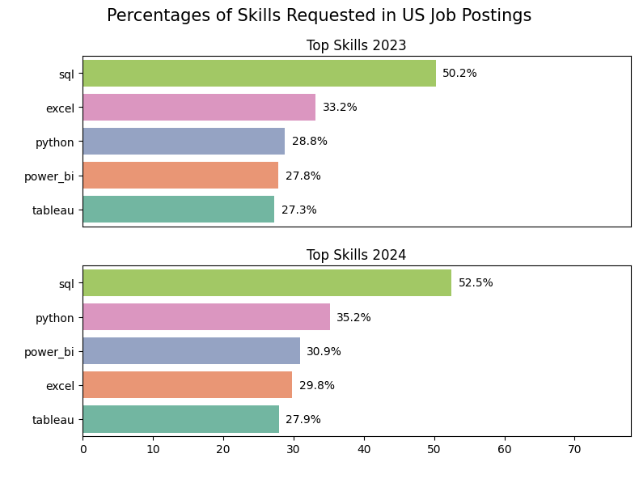
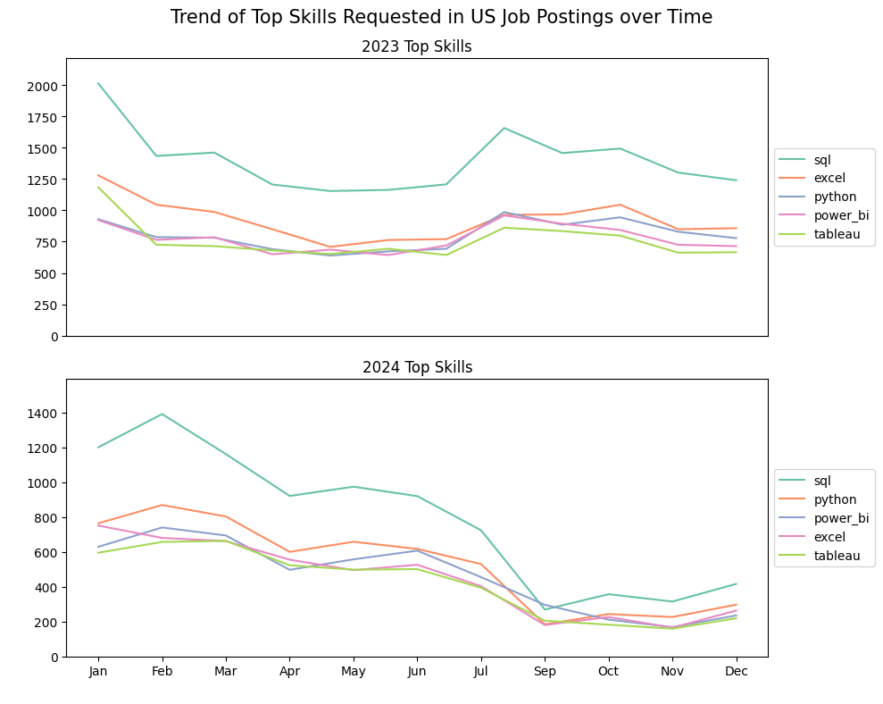
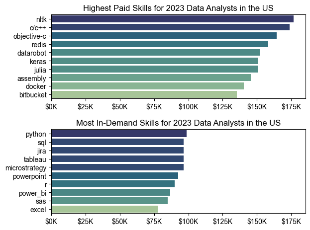

# 📈 Data Analyst Jobs — Market Analysis (2023–2025)

## Overview
This project focuses on the **Data Analyst** job market using Luke Barousse's dataset (`gsearch_jobs.csv`).  
It investigates trends, skill demand, salary profiles, and identifies *optimal skills* (high demand + good pay) between 2023 and early 2025.

Key goals:
- Track posting trends for Data Analyst roles over time.
- Identify the most in-demand skills and their trends.
- Compare skill demand with salary to find high-value skills.
- Provide actionable insights for learners and hiring teams.


## Dataset
- **Source:** [Luke Barousse's Python Course](https://www.kaggle.com/datasets/lukebarousse/data-analyst-job-postings-google-search)  
- **Time range:** 2023 → 2025 (partial for 2025)  
- **Main columns used:**  
  `job_title` / `job_Title_short`, `date_time`, `country`, `company_name`, `location`, `job_skills` (list), `salary_standardized` (numeric median), `description_tokens`.


## The Questions
1. What are the top skills requested for Data Analyst roles, and how did they change (2023 vs 2024)? 
2. How did Data Analyst postings trend month-by-month?   
3. Which skills correlate with higher salaries for Data Analysts?  
4. What are the *optimal skills* — those that combine high demand and high median pay?


## Data cleaning & quick code (essential steps)
Minimal, focused snippet — put this in the notebook (already used in the project):

```python
import pandas as pd
import ast

df = pd.read_csv("gsearch_jobs.csv", index_col=0)

# Basic cleaning: remove unneeded cols, parse dates, parse skills lists
df.drop(columns=['index','commute_time','salary','extensions','posted_at'], errors='ignore', inplace=True)
df['date_time'] = pd.to_datetime(df['date_time'])
df['job_skills'] = df['description_tokens'].apply(lambda x: ast.literal_eval(x) if pd.notna(x) else [])
df.reset_index(drop=True, inplace=True)
```

## Analysis

### Skills Demand

We analyzed the most requested job skills in postings for 2023 vs 2024. This highlights which tools and techniques employers consistently value, and which skills are gaining or losing relevance.

```python
fig , ax = plt.subplots(2 , 1 , figsize = (8,6))
sns.barplot(data = df_year , x = 'skills_per', y = 'job_skills', hue = 'skills_count', ax = ax[i] , palette = "Set2")
```

### Result


### 💡 Insights

- **SQL’s dominance increased**: From 50.2% in 2023 to 52.5% in 2024, showing that SQL is still the cornerstone for data jobs.

- **Python’s sharp growth**: Python grew from 28.8% in 2023 to 35.2% in 2024, reflecting how employers are increasingly valuing programming and automation over purely manual tools.

- **Power BI overtaking Excel**: In 2024, Power BI (30.9%) slightly surpassed Excel (29.8%), confirming the industry trend toward interactive dashboards and real-time business intelligence.

- **Tableau steady but lower**: Tableau demand stayed almost the same (27.3% → 27.9%), meaning it is still important, but Power BI is clearly taking the lead as the preferred BI tool.

### Skills Trend

We tracked the monthly demand for the top 5 skills in 2023 and 2024 to identify hiring seasonality and evolving requirements.

```python
fig , ax = plt.subplots(2 , 1 , figsize = (10,8))
sns.lineplot(data = df_year , dashes = False , legend = 'full', palette = 'Set2' , ax = ax[i])
```
### Result


### 💡 Insights

- SQL dominates both years: Throughout 2023 and 2024, SQL was consistently the most requested skill in job postings, highlighting its role as a fundamental tool for data-related roles.

- Python on the rise in 2024: While Python was behind Excel in 2023, it overtook Excel in 2024, showing its growing importance for data roles, especially with the rise of automation, analytics, and AI applications.

- Excel demand slightly declining: Excel had a steady demand in 2023 but saw a relative decline in 2024, being surpassed by Python and Power BI — suggesting a market shift from traditional tools to more technical and visualization-focused ones.

- BI Tools gaining traction: Power BI and Tableau remained consistently demanded, with Power BI growing stronger in 2024 compared to Tableau, signaling its increasing adoption among businesses.

### Salary Analysis

We examined the relationship between skills, demand, and salary for 2023 and 2024. The goal was to identify whether the most in-demand skills also command the highest pay.

```python
top_count_2023 = df_DA_2023_exploded.groupby('job_skills')['salary_standardized'].agg(['median','count']).sort_values(by='count',ascending=False).head(10)

top_pay_2023 = df_DA_2023_exploded.groupby('job_skills')['salary_standardized'].agg(['median','count']).sort_values(by='median',ascending=False).head(10)

fig, ax = plt.subplots(2, 1)  
sns.barplot(data=top_pay_2023, x='median', y=top_pay_2023.index, hue='median', ax=ax[0] , palette =palette )
sns.barplot(data=top_count_2023, x='median', y=top_count_2023.index, hue='median', ax=ax[1], palette = palette)
```
### Result


### 💡 Insights
**Core skills = high demand, stable salaries**

- Python ($98.8K, 1093 jobs) and SQL ($96.5K, 2299 jobs) dominate both demand and solid pay, making them the foundation for data careers.

- Tableau ($96.5K, 1378 jobs) and Excel ($78K, 1565 jobs) highlight the continued importance of visualization and reporting.

Business & collaboration tools matter

- Jira ($96.5K, 323 jobs) and PowerPoint ($92.5K, 342 jobs) are surprisingly valuable, showing that communication and project management are critical even in technical roles.

**Specialized & niche = highest salaries**

- Rare skills like NLTK ($176.6K), C/C++ ($173.7K), and Redis ($158K) lead the salary chart but have very few postings → great ROI for specialists.

- Keras ($150.8K, 7 jobs) and Julia ($150.8K, 5 jobs) show strong pay for advanced machine learning and emerging languages.

DevOps & Systems boost paychecks

- Docker ($140.4K, 31 jobs) and Assembly ($145.5K, 10 jobs) highlight how infrastructure and low-level systems knowledge command premium salaries.

```python
top_count_2024 = df_DA_2024_exploded.groupby('job_skills')['salary_standardized'].agg(['median','count']).sort_values(by='count',ascending=False).head(10)

top_pay_2024 = df_DA_2024_exploded.groupby('job_skills')['salary_standardized'].agg(['median','count']).sort_values(by='median',ascending=False).head(10)

fig, ax = plt.subplots(2, 1)  
sns.barplot(data=top_pay_2024, x='median', y=top_pay_2024.index, hue='median', ax=ax[0] , palette =palette )
sns.barplot(data=top_count_2024, x='median', y=top_count_2024.index, hue='median', ax=ax[1], palette = palette)
```
### Result


### 💡 Insights
- Azure ($108K, 184 jobs) and AWS ($102.5K, 198 jobs) dominate both demand and pay → Cloud skills are now essential for modern data roles.

**Core Skills Remain Non-Negotiable**
- Python ($100K, 914 jobs), SQL ($100K, 1316 jobs), and Tableau ($100K, 730 jobs) remain the most in-demand skills → these are the entry ticket to any data job.

- R ($100K, 552 jobs) and Power BI ($93.5K, 833 jobs) also play a strong role in analytics and reporting.

**Legacy Tools Still Matter**

- Excel ($75K, 837 jobs) and SAS ($100K, 183 jobs) are still heavily used in traditional industries like finance, healthcare, and government.

- Even Word ($65.5K, 195 jobs) shows that communication/documentation tools remain relevant.

**Highest Salaries = Specialized & Niche**

- Advanced tools and languages like Julia ($172.5K), Golang ($162.5K), and MXNet ($157.7K) command very high salaries but appear in very few postings.

- NoSQL ($150K, 7 jobs) and MongoDB ($137.6K, 8 jobs) highlight the value of non-relational databases in Big Data roles.

- PySpark ($137.2K, 28 jobs) proves that Big Data frameworks are a reliable path to higher-paying roles.
## Optimal Skills

We compared skills by frequency (demand) and median salary to highlight the "optimal" skills that balance both.

```python
top_skills_2023 = df_DA_2023.groupby('job_skills')['salary_standardized'].agg(['median','count']).sort_values(by='count',ascending=False).head(10)

top_skills_2024 = df_DA_2024.groupby('job_skills')['salary_standardized'].agg(['median','count']).sort_values(by='count',ascending=False).head(10)

fig , ax =plt.subplots(1,2,figsize=(12,5))
sns.scatterplot(data = df_years[i] , x="skill count", y="median salary" , hue=df_year.index , palette="tab10", s=100 , ax=ax[i])
```
### Result


### 💡 Insights
**Optimal Skills Insights (2023 vs 2024)**

- SQL & Python = The Core Foundation

- 2023: SQL (2,299 jobs, $96.5K) and Python (1,093 jobs, $98.8K) dominated demand.

- 2024: Both stayed at the top — SQL (1,316 jobs, $100K) and Python (914 jobs, $100K) → still the entry ticket for any data role.

**Visualization & BI Tools Are Critical**

- 2023: Tableau (1,378 jobs, $96.5K), Power BI (1,026 jobs, $86.7K), and Excel (1,565 jobs, $78K) were key.

- 2024: Power BI (833 jobs, $93.5K), Tableau (730 jobs, $100K), and Excel (837 jobs, $75K) remain highly requested → clear proof that communication of insights is as important as technical skills.

**Programming Languages Beyond Python**

- R ($90K, 643 jobs in 2023 → $100K, 552 jobs in 2024) shows steady demand for statistical/academic use cases.

- While demand slightly dropped, salaries increased — R specialists are still rewarded well.

**New Stars: Cloud Skills**

- 2024 introduces AWS ($102.5K, 198 jobs) and Azure ($108K, 184 jobs) into the top skills list → Cloud is now mandatory for modern data professionals.

**Collaboration & Productivity Tools**

- 2023: PowerPoint ($92.5K, 342 jobs) and Jira ($96.5K, 323 jobs) proved that collaboration skills matter.

- 2024: Word ($65.5K, 195 jobs) enters the list → soft/project tools are still valued, even in technical roles.

**Legacy Tools Hold Ground**

-SAS ($85K in 2023 → $100K in 2024) remains relevant in finance, healthcare, and government — fewer postings but higher salaries.

## Tools & Notes
Python (pandas, matplotlib, seaborn) — main stack.

adjustText for labeling scatterplots (optional).

Data may include missing salary values — salary analysis uses only standardized salary rows.


