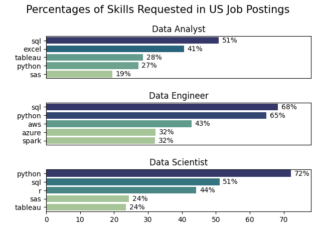

# 📊 All Jobs Market Analysis
## Overview

This project explores the global data job market in 2023, analyzing job postings to uncover insights into roles, skills, companies, and opportunities.
Using Python (Pandas, Matplotlib, Seaborn), the analysis highlights:

The most in-demand job titles.

Countries and companies driving the hiring landscape.

Job sources.

Benefits and opportunities (remote work, degree requirements, health insurance).

The skills most frequently requested in US job postings.

This project provides a clear view of the job market, helping both aspiring and current professionals identify where demand lies and which skills to prioritize.

## Dataset

Source: [Luke Barousse's Python Course](https://lukebarousse.com/python)

Year: 2023

Size: 785,741 rows × 17 columns

Main columns used in this project:

- `job_title_short` : Standardized job title

- `job_posted_date` : Date when the job was posted

- `job_country` : Country of the posting

- `company_name` : Hiring company

- `job_via` : Source of the posting (LinkedIn, Indeed, etc.)

- `job_skills` : Required technical skills

- `job_type_skills` : Categorized skills (programming, databases, etc.)

- `job_work_from_home` , `job_no_degree_mention` , `job_health_insurance` : Job benefits

## The Questions

1- EDA 
- What are the top job titles by demand?

- Which countries post the most data-related jobs?

- Which companies are leading in hiring?

- What are the main job sources for postings?

- What opportunities are offered (remote work, no degree requirement, insurance)?

2- Which skills are most in demand for the top US job roles?

## Data Cleaning & Preprocessing

Key steps applied before analysis:
```python
#Remove duplicates and empty rows
df.drop_duplicates(inplace=True)
df.dropna(how='all', inplace=True)

# Convert job_posted_date to datetime
df['job_posted_date'] = pd.to_datetime(df['job_posted_date'])

# Convert string lists to actual Python lists
df['job_skills'] = df['job_skills'].apply(lambda x: ast.literal_eval(x) if pd.notna(x) else x)
df['job_type_skills'] = df['job_type_skills'].apply(lambda x: ast.literal_eval(x) if pd.notna(x) else x)
```
**For skills demand, the analysis was narrowed down to the United States:**
```python

df_US = df[df['job_country'] == 'United States'].copy()
```

## Analysis
###  Top Job Titles

- The most common job titles were extracted and visualized.

```python
job_title_count = df['job_title_short'].value_counts().reset_index().head(10)
```

### 📌 Insights

- Data Analyst is the most in-demand role.

- Data Engineer and Data Scientist also rank high in postings.

### Top Countries

- We identified the countries with the highest job postings.

```python
Country_count = df['job_country'].value_counts().reset_index().head(10)
```

### 📌 Insights

- The United States leads by a wide margin.

- The UK, Canada, and India also show strong demand.

### Top Companies

- Top employers were analyzed to reveal leading hiring companies.

```python
Company_count = df['company_name'].value_counts().reset_index().head(10)
```

### 📌 Insights

- Several tech giants dominate hiring (e.g., Meta, Google, Amazon).

- Consulting firms and financial institutions also appear prominently.

### Job Sources

- Analysis of where postings come from.

```python
job_via_counts = df['job_via'].value_counts().reset_index().head(6)
```

### 📌 Insights

- LinkedIn is the largest job source.

- Indeed and Glassdoor also contribute significantly.

### Job Opportunities

- We explored benefits such as remote work, degree requirements, and insurance.

```python
dict_column = {
    'job_work_from_home': 'Work from Home Offered',
    'job_no_degree_mention': 'Degree Requirement',
    'job_health_insurance': 'Health Insurance Offered'
}
```

### 📌 Insights

- **Work from Home Opportunities**: A significant majority (91.1%) of job postings offer remote or work-from-home options, highlighting the industry's strong adoption of flexible work models.

- **Degree Requirement**: Around 69.4% of job postings explicitly mention the need for a degree, while 30.6% do not, showing that many employers are becoming more flexible with formal education requirements.

- **Health Insurance Benefits**: Nearly 89% of job postings provide health insurance, underscoring the importance of competitive benefits in attracting and retaining talent.

### Skills Demand in the US

- We drilled down into skills per role for the US market.

```python
skills_exploded = df_US.explode('job_skills')
job_skills_count = skills_exploded.groupby(['job_skills','job_title_short']).size().reset_index(name='skills_count')

fig ,ax=plt.subplots(3,1)
data_plot=job_skills_per[job_skills_per['job_title_short']==job_title].head(5)
    sns.barplot(data=data_plot,x='skill_per',y='job_skills',hue='skills_count',ax=ax[i],palette=pallete)
```
### Results

)

### 📌 Insights:

- SQL and Python dominate across all roles.

- Excel remains key for Data Analysts.

- Cloud platforms (AWS, Azure) and Spark are critical for Data Engineers.

- Machine Learning libraries (TensorFlow, PyTorch) are valued for Data Scientists.

## Conclusion

This project highlights the global job market for data roles, showing:

The dominance of Data Analysts in demand.

The US as the largest market.

Clear role-specific skill demands (SQL, Python, Excel, Cloud, ML).

Growing opportunities without strict degree requirements.


**These insights can guide aspiring professionals in prioritizing skills and career path**
